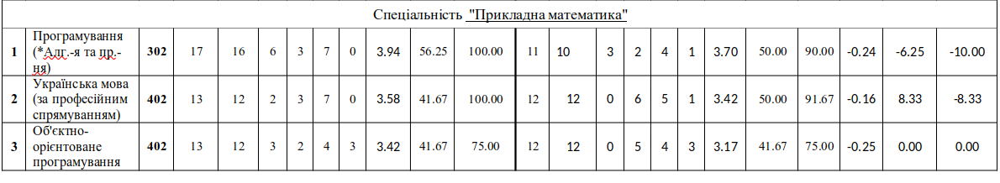
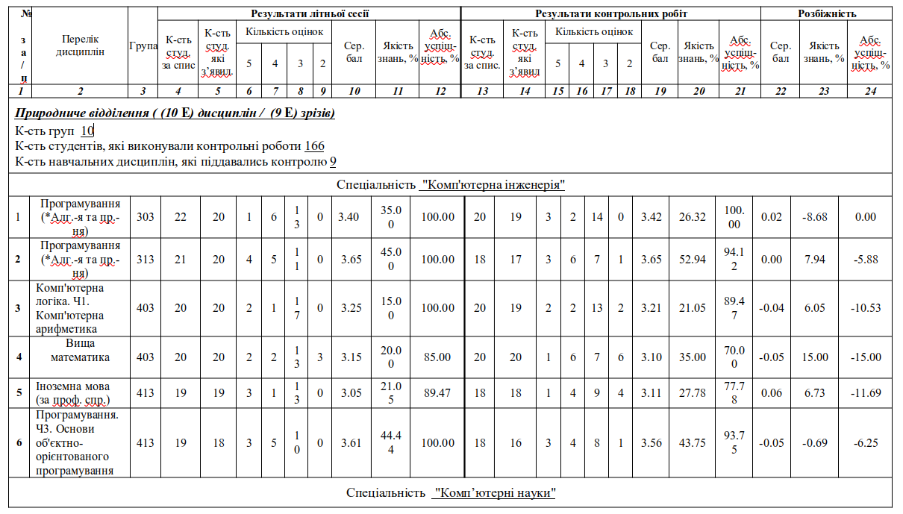
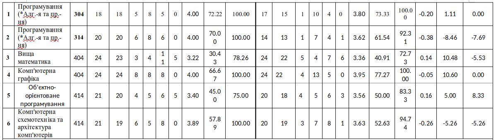

# звіт\_2022 2023н.р

#### ПРОЄКТ

#### Звіт діяльності природничого відділення у І семестрі 2022-2023 навчальному році

_**Природниче відділення**_

**\_\_ \_\_\_\_\_\_\_ 2023 р.**

Звіт завідувача природничого відділення

Ковдриша Володимира Володимировича

За І семестр 2022-2023 н.р.

1. Проведення профорієнтаційної роботи з метою формування контингенту студентів на 2023-2024 н.р.
2. Контингент студентів (кількість груп, спеціальностей, кількість студентів, які навчаються за державним замовленням та за повну оплату вартості навчання). Кількість студентів, які потребують соціальної підтримки. &#x20;
3. Контроль за навчальним процесом, кількість відвіданих занять з метою контролю, висновки про якість проведення занять. Проведено відкриті заняття.
4. Виховна і позааудиторна робота, яка здійснюється викладачами на відділенні.
5. Робота з кураторами та старостами навчальних груп. Самоврядування на відділенні.
6. Проживання студентів відділення в гуртожитку, робота з батьками.
7. Зв’язок з виробництвом і стейкхолдерами.

ВСТУП

Природниче відділення – це одне з найперших відділень у структурі ВСП «Фаховий коледж ЧНУ», яке забезпечує підготовку висококваліфікованих і конкурентоспроможних на ринку праці фахівців у ІТ сфері. Природниче відділення здійснює підготовку молодших спеціалістів та фахових молодших бакалаврів з трьох спеціальностей:

* 113 Прикладна математика
* 122 Комп’ютерні науки
* 123 Комп’ютерна інженерія

1\. Проведення профорієнтаційної роботи з формування контингенту студентів.

З метою забезпечення прийому студентів на навчання був розроблений та здійснений план заходів, щодо залучення майбутніх студентів коледжу шляхом проведення підготовчих курсів.

2\. Контингент студентів.

На природничому відділенні навчається 413 студентів, з них  328 особи, що фінансуються за рахунок коштів Державного бюджету, та на умовах контракту – 85 студентів.

Чисельність здобувачів освіти за спеціальностями склала:

* Прикладна математика – 61 особа;
* Комп’ютерні науки – 176 осіб;
* Комп’ютерна інженерія – 176 особи.

|                           | Дівчата | Хлопці | 
Загальна кількість
 | Сільське населення | Міське населення | Мол. спец. | Фахов. мол. бакалавр |
| ------------------------- | ------- | ------ | ---------------------------- | ------------------ | ---------------- | ---------- | -------------------- |
| 113 Прикладна математика  |         |        |                              |                    |                  |            |                      |
| Всього:                   | **14**  | 47     | 61                           | 24                 | 37               | 23         | 38                   |
| 122 Комп’ютерні науки     |         |        |                              |                    |                  |            |                      |
| Всього:                   | 28      | 148    | 176                          | 124                | 52               | 76         | 100                  |
| 123 Комп’ютерна інженерія |         |        |                              |                    |                  |            |                      |
| Всього:                   | 7       | 169    | 176                          | 133                | 23               | 75         | 101                  |
| Всього по відділенню:     | 49      | 364    | 413                          | 281                | 112              | 174        | 239                  |

3\. Контроль за навчальним процесом на відділенні

Основою планування освітнього процесу на економічному відділенні є Закон України “Про вищу освіту”, Положення про організацію навчального процесу у ВСП «Фаховий коледж ЧНУ».

Навчально-виховна робота на відділенні підпорядковується реалізації вимог освітньо-професійних програм спеціальностей та освітньо-кваліфікаційних характеристик фахівців.

Для всіх навчальних дисциплін були розроблені та затверджені на засіданні циклових комісій прикладної математики та інформаційних технологій, комп’ютерних наук, комп’ютерної інженерії та засіданні методичної ради коледжу робочі програми дисциплін та навчальних практик.

Впродовж семестру проводиться контроль та аналіз успішності студентів, застосовуються заходи щодо забезпечення високого рівня успішності на відділенні. Здійснюється систематичний контроль за організацією та проведенням освітнього процесу шляхом відвідування відкритих та поточних занять викладачів, перевірки дотримання розкладу аудиторних занять, навчальних і виробничих практик, ступеню відповідності тематики аудиторних занять навчальній та робочій програм дисциплін і практик.

Для перевірки і оцінки якості навчальної роботи запроваджено проведення з усіх дисциплін гуманітарної, соціально-економічної, природничо-наукової, професійної та практичної підготовки комплексні контрольні роботи та тести з можливістю використання комп’ютерних програм.

**Інформація про результати залишкових знань студентів за наслідками проведеного ректорського контролю з навчальних дисциплін літньої сесії**

  

За другий семестр 2022-2023 н.р. проведена значна робота з оволодіння інноваційними технологіями навчання та впровадження їх в освітній процес. Значна увага приділяється підготовці навчально-методичних комплексів професійно-орієнтованих дисциплін, вдосконаленню наявного навчально-методичного комплексу дисциплін відповідно до вимог ліцензування.

Робота викладачів спрямовується на підготовку методичних розробок, навчальних посібників. Викладачі відділення розробляють і вдосконалюють курси на платформі Moodle.

На природничому відділенні регулярно оновлюється навчально-методичне забезпечення дисциплін як ОКР Молодший спеціаліст, так і ОПС Фаховий молодший бакалавр. Ведення журналів обліку навчальних занять відбувається відповідно до правил заповнення та Положень щодо освітнього процесу в коледжі.

Викладачі циклових комісій прикладної математики та інформаційних технологій, комп’ютерних наук, комп’ютерної інженерії активно беруть участь у регіональних, Всеукраїнських та міжнародних заходах. Однією із найважливіших умов якісної підготовки фахівців є належне кадрове забезпечення освітнього процесу. В коледжі розроблено п’ятирічний план підвищення кваліфікації, який виконується повною мірою. Результати підвищення кваліфікації науково-педагогічних працівників впроваджуються в освітній процес.

Систематично відбуваються засідання циклових комісій прикладної математики та інформаційних технологій, комп’ютерних наук, комп’ютерної інженерії, на яких аналізуються та розглядаються актуальні питання навчального процесу (постійний моніторинг освітнього процесу, аналіз успішності здобувачів освіти за модульним та сесійним контролем, проводяться зрізи знань студентів), напрями розвитку ІТ галузі країни та регіону.&#x20;

В умовах воєнного стану, всі студенти природничого відділення навчались дистанційно, були підключені до соціальних мереж, інтернету, Google Meet, Moodle, Classtime, Google Class, Zoom, Skype, Viber, електронна пошта, електронний журнал та інше, що дало змогу здобувачам вищої освіти опрацьовувати матеріали та здавати заліково-екзаменаційну сесію. Дистанційне навчання, це можливість отримувати необхідні знання, віддалено від навчального закладу. Навчаючись дистанційно студенти ознайомлювалися з усією необхідною інформацією (розкладами на сайті коледжу).

Взаємовідвідування викладачами циклової комісії

Прикладної математики та інформаційних технологій

| №  | Прізвище, ім’я, по батькові викладача | Кількість відвіданих занять |
| -- | ------------------------------------- | --------------------------- |
| 1  | Луцюк Юрій Віталійович                | 10                          |
| 2  | Юрійчук Анастасія Олександрівна       | 2                           |
| 3  | Шепетюк Богдан Дмитрович              | 2                           |
| 4  | Житарюк Іван Васильович               | 2                           |
| 5  | Онипа Денис Павлович                  | 2                           |
| 6  | Сопронюк Тетяна Миколаївна            | 2                           |
| 7  | Бігун Ярослав Йосипович               | 2                           |
| 8  | Бунєвич Вікторія Вікторівна           | 2                           |
| 9  | Данилюк Іван Михайлович               | 2                           |
| 10 | Григорець Олена Павлівна              | 2                           |

Взаємовідвідування викладачами циклової комісії

Комп’ютерних наук

| № | Прізвище, ім’я, по батькові викладача | Кількість відвіданих занять |
| - | ------------------------------------- | --------------------------- |
| 1 | Коропецький Василь Васильович         | 7                           |
| 2 | Ковдриш Володимир Володимирович       | 3                           |
| 3 | Гудзик Ілля Васильович                | 2                           |
| 4 | Гуцул Тетяна Олександрівна            | 2                           |
| 5 | Лазорик Василь Васильович             | 2                           |
| 6 | Фратавчан Валерій Григорович          | 2                           |

Взаємовідвідування викладачами циклової комісії

Комп’ютерної інженерії

| №  | Прізвище, ім’я, по батькові викладача | Кількість відвіданих занять |
| -- | ------------------------------------- | --------------------------- |
| 1  | Тащук Олександр Юрійович              | 11                          |
| 2  | Білошицький Андрій Вікторович         | 2                           |
| 3  | Букурос Олеся Вікторівна              | 2                           |
| 4  | Горський Геннадій Петрович            | 2                           |
| 5  | Мельничук Христина Володимирівна      | 2                           |
| 6  | Воробець Олександр Іванович           | 2                           |
| 7  | Воропаєва Світлана Львівна            | 2                           |
| 8  | Гімчинська Сніжана Юріївна            | 2                           |
| 9  | Деревянчук Олександр Володимирович    | 2                           |
| 10 | Іванущак Наталя Михайлівна            | -                           |
| 11 | Плахов Олександр Олександрович        | 2                           |

Планують атестувалися в 2023-2024 навчальному році: Деревянчук М.Я., Тащук О.Ю., Сікора В.С., Коропецький В.В., Мігорян М.В.

Проведено за семестр відкриті заняття: Буневич В.В., Кондрюк Д.В.

Результати успішності студентів природничого відділення

Форми контролю знань і умінь здобувачів освіти на відділенні використовують відповідно до робочих навчальних планів. На рівні навчальних дисциплін проводився також контроль умінь та навичок студентів шляхом перевірки та оцінювання якості виконання лабораторних і практичних робіт, завдань, які виносяться на самостійну роботу студентам, а також при проходженні навчальної практики. Викладачі комісії проводить активну роботу щодо впровадження мультимедійних технологій з метою покращення якості навчання. Сучасні інформаційні технології стають невід’ємною, ефективною та результативною частиною навчання.

Якісна успішність (по першій відомості) за другий семестр навчального року наступна:

Прикладана математика:

Комп’ютерні науки:

Комп’ютерна інженерія:

ІНФОРМАЦІЯ

про відмінників на природничому відділенні у ІІ семестрі 2022-2023 н.р.

| №      | Група                         | Всього студентів | Кількість студентів відмінників | Прізвище, ім’я, по батькові |
| ------ | ----------------------------- | ---------------- | ------------------------------- | --------------------------- |
|        | **113 Прикладна математика**  |                  |                                 |                             |
| 1      | 102                           |                  |                                 |                             |
|        |                               |                  |                                 |                             |
| 2      | 202                           |                  |                                 |                             |
| 3      | 302                           |                  |                                 |                             |
| 4      | 402                           |                  |                                 |                             |
|        |                               |                  |                                 |                             |
|        | **122 Комп’ютерні науки**     |                  |                                 |                             |
| 5      | 104                           |                  |                                 |                             |
| 6      | 114                           |                  |                                 |                             |
| 7      | 204                           |                  |                                 |                             |
| 8      | 214                           |                  |                                 |                             |
| 9      | 304                           |                  |                                 |                             |
|        |                               |                  |                                 |                             |
|        |                               |                  |                                 |                             |
| 10     | 314                           |                  |                                 |                             |
|        |                               |                  |                                 |                             |
|        |                               |                  |                                 |                             |
|        |                               |                  |                                 |                             |
| 11     | 404                           |                  |                                 |                             |
|        |                               |                  |                                 |                             |
| 12     | 414                           |                  |                                 |                             |
|        |                               |                  |                                 |                             |
|        | **123 Комп’ютерна інженерія** |                  |                                 |                             |
| 13     | 103                           |                  |                                 |                             |
| 14     | 113                           |                  |                                 |                             |
| 15     | 203                           |                  |                                 |                             |
| 16     | 213                           |                  |                                 |                             |
| 17     | 303                           |                  |                                 |                             |
| 18     | 313                           |                  |                                 |                             |
|        |                               |                  |                                 |                             |
|        |                               |                  |                                 |                             |
| 19     | 403                           |                  |                                 |                             |
|        |                               |                  |                                 |                             |
| 20     | 413                           |                  |                                 |                             |
| Всього |                               | **413**          |                                 |                             |

Впродовж другого семестру 2022-2023 н.р. з метою організації контролю за виконанням робочих програм дисциплін, успішності студентів, пропусків занять та аналізу їх відпрацювання на відділенні ведуться наступні документи: «План роботи відділення», «Індивідуальний план роботи викладача», а в академічних групах «Журнал обліку роботи академічної групи», «Журнал роботи куратора групи».

З метою збереження контингенту студентів викладачами та кураторами груп відділення постійно ведеться облік успішності і відвідування занять студентами із щомісячним аналізом. На відділенні приділяється значну увагу розвитку студентської науки.

4\. Виховна і позааудиторна робота, яка здійснюється викладачами на відділенні

На природничому відділенні приділяється велика увага організації позааудиторній та виховній роботі зі студентами, яка будується на принципах взаємодії з органами студентського самоврядування, та спрямована на виховання у студентів високих моральних якостей, підготовку гармонійно розвиненої активної особистості. З цією метою здійснювалися заходи щодо активізації функціонування інституту кураторства, із залучення студентства до організації освітнього процесу, з підтримки участі студентів у спортивних та культурно-масових заходах.

На формування здорового способу життя студентів, направлена спортивно-масова робота. &#x20;

5\. Робота з кураторами та старостами навчальних груп. Самоврядування на відділенні

Старостат, як  виконавчий орган, діє на відділенні і у гуртожитку. На відділенні старостат проходить по вівторкам.

Виконавчі органи студентського самоврядування коледжу – студентська рада природничого відділення, старостат, рада гуртожитку в яку входять студенти природничого відділення – здійснюють наступні функції:

* беруть участь в управлінні коледжем у порядку, встановленому Законом України «Про вищу освіту» та Статутом ВСП «Фаховий коледж ЧНУ», в обговоренні та вирішенні питань удосконалення навчально-виховного процесу;
* проводять організаційні, просвітницькі, наукові, спортивні, оздоровчі та інші заходи;
* захищають права та інтереси студентів природничого відділення;
* делегують своїх представників до стипендіальної комісії;
* приймають акти, що регламентують організацію та діяльність органів самоврядування;
* беруть участь у вирішенні питань забезпечення належних побутових умов проживання студентів у гуртожитках;
* вносять пропозиції щодо розвитку матеріальної бази коледжу, у тому числі з питань, що стосуються побуту та відпочинку студентів;
* сприяють проведенню серед студентів соціологічних досліджень.

Список старост та кураторів груп природничого відділення

| _**К-сть студ.**_                                   | 
<em><strong>Шифр</strong></em>

<em><strong>групи</strong></em>
 | _**Спеціальність**_   | _**Куратор**_                                 | _**Старости**_                         |
| --------------------------------------------------- | --------------------------------------------------------------------------- | --------------------- | --------------------------------------------- | -------------------------------------- |
| **30**                                              | 11-ПМ                                                                       | Прикладна математика  | Погребенник Зоряна Василівна                  | Жолтвінський М.В.                      |
| **25**                                              | 11-КІ                                                                       | Комп’ютерна інженерія | Молдован Володимир Іванович                   | Буджак Я.В.                            |
| **25**                                              | 12-КІ                                                                       | Комп’ютерна інженерія | Марку Василь Іванович                         | Раздорський А.Р.                       |
| **122**                                             | 11-КН                                                                       | Комп’ютерні науки     | Коропецький Василь Васильович                 | Дузян Є.О.                             |
| **25**                                              | 12-КН                                                                       | Комп’ютерні науки     | Луцюк Юрій Віталійович                        | Жалоба В.І.                            |
| **15**                                              | 21-ПМ                                                                       | Прикладна математика  | Григорець Олена Павлівна                      | Глушку І.Р.                            |
| **24**                                              | 21-КІ                                                                       | Комп’ютерна інженерія | Ратушняк Уляна Романівна                      | Кузенко О.В.                           |
| **25**                                              | 22-КІ                                                                       | Комп’ютерна інженерія | Колотило Інна Леонідівна                      | Сорохан М.Н.                           |
| **24**                                              | 21-КН                                                                       | Комп’ютерні науки     | Марко Ірина Вікторівна                        | Городенський Д.Д.                      |
| **24**                                              | 22-КН                                                                       | Комп’ютерні науки     | Завійська Тетяна Анатоліївна                  | Васильчук Д.А.                         |
| **18**                                              | 31-ПМ                                                                       | Прикладна математика  | Погребенник Андрій Іванович                   | Филипчук М.М.                          |
| **25**                                              | 31-КІ                                                                       | Комп’ютерна інженерія | Кречун Ірина Вікторівна                       | Кирчук К.К.                            |
| **23**                                              | 32-КІ                                                                       | Комп’ютерна інженерія | Букурос Леся Вікторівна                       | Ракул К.О.                             |
| **25**                                              | 31-КН                                                                       | Комп’ютерні науки     | Апухтіна Анна Анатоліївна                     | Бестанчук Б.В.                         |
| **22**                                              | 32-КН                                                                       | Комп’ютерні науки     | Крошка Тетяна Іллівна                         | Пацарнюк Х.В.                          |
| 
<strong>9</strong>

<strong>20</strong>
 | 41-ПМ                                                                       | Прикладна математика  | 
Мельничук Христина

Володимирівна
 | 
Островець О.С.

Буряк З.Д.
 |
| 41-КІ                                               | Комп’ютерна інженерія                                                       |                       |                                               |                                        |
| **17**                                              | 42-КІ                                                                       | Комп’ютерна інженерія | Дутчак Світлана Василівна                     | Псюк П.В.                              |
| **31**                                              | 41-КН                                                                       | Комп’ютерні науки     | Білошицький Андрій Вікторович                 | Пуюл Д.М.                              |

6\. Проживання студентів відділення в гуртожитку, робота з батьками

У звітному періоді організовувалося поселення студентів у гуртожитки. І на разі у гуртожитках мешкають 193 студентів природничого відділення. Здійснювався постійний контроль за дотриманням студентами правил проживання у гуртожитках.

Студенти природничого відділення, які входять до студради гуртожитку старанно та відповідально виконують свої обов'язки. Вони приймають активну участь в різноманітних формах і видах діяльності, вони усвідомлюють відповідальність за свій здоровий спосіб буття. Здійснюють фізіологічну і психологічну саморегуляцію, глибше засвоюють проблеми особистої гігієни, а також праці і навчання, раціонально використовують свій вільний час.  &#x20;

Розроблені правила техніки безпеки та наявні журнали, де вносяться відповідні записи.

Здійснюється постійний контроль за дотриманням студентами правил проживання в гуртожитку.

Крім того, кураторами 2-го курсу була проведена робота з батьками, щодо важливості підтримки у організації вибору їхніми дітьми дисциплін ЗНО (мультитесту), яке відбудеться в кінці цього навчального року

7\. Зв’язок з виробництвом і стейкхолдерами

Під час організації та реалізації освітнього процесу враховується думка стейкхолдерів та роботодавців щодо необхідних компетентностей випускника на ринку праці і забезпечується їх участь в освітньому процесі.

З метою подальшої ефективної роботи природничого відділення необхідно:

&#x20;\- виконання ліцензійного обсягу набору студентів за всіма напрямами підготовки і спеціальностями;

\- формування та набуття студентами універсальних і практичних знань, вмінь та навичок, які забезпечать високоякісну професійну підготовку майбутніх фахівців – випускників природничого відділення.
